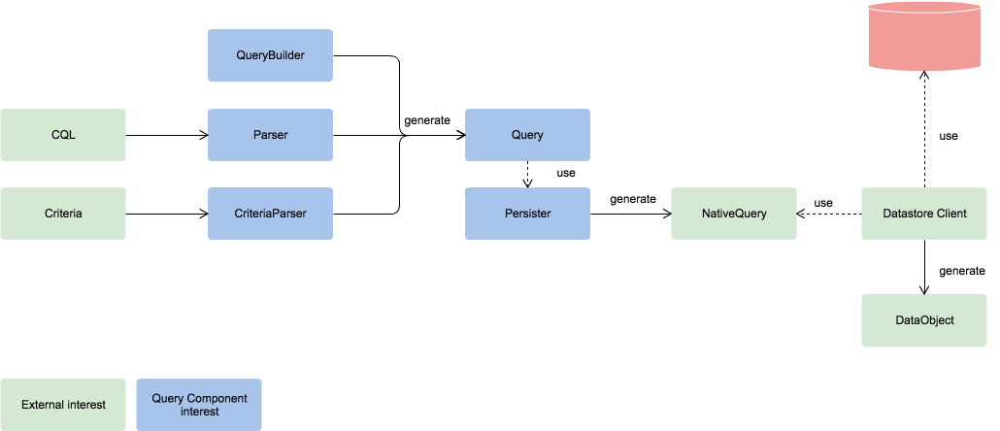

# 設計

## インタレスト

ドメイン駆動を意識する上で、各レイヤー、レイヤー間のインターフェースは、特定のデータストア・検索エンジンに依存するべきではないと考えます。
ウェブアプリケーションレイヤー、プラットフォームレイヤーなど各レイヤー間での、また、データストア層の柔軟な選択（再選択）に合わせ、データの検索・取得のためのクエリは、決められたデータストア層に合わせるべきではありません。
これらを踏まえ、しかし、ユーザビリティの観点から、「一つの共通化されたクエリを用いる」ことは重要な課題になります。

Query Componentは、この、共通化されたクエリを用い、しかしながら、実データストアに依存しないようにするために考えられたコンポーネントです。

## クエリの作成

Query Componentは、以下の３つアプローチから、柔軟にクエリオブジェクトを作成することが可能です。

  - QueryBuilder: DoctrineQeuryを参考に考えられた、QueryBuilderクラスを通し、Queryを作成することが可能です。
  - Parser: 独自に定義付けたCQL(Custom Query Language)を解析し、Queryオブジェクトを生成するための機構
  - Criteria: フィールド対値、または、フィールド対FQL(Field Query Language)を用いて、Queryオブジェクトを生成するための機構
  

## データストアレイヤーへの対応

Query Componentが想定するデータストアレイヤーは、以下の通りです。

  - 実データストア:（DoctrineORMやLucene全文検索エンジンなどデータストア・検索エンジンサービス）
  - 仮想データストア・下位レイヤー: ドメインによって別れた下位レイヤーとのQueryの受け渡し

実データストアには、ライブラリを使い直接アクセスするもの、外部ライブラリを用いてアクセスするものなどが存在します。また、多くのクラウドサービスは、WebAPI(REST/RESTfulなどのHttpプロトコル)が準備されています。 

このように、Queryオブジェクトが生成するNativeQueryは、下位レイヤーに応じ、変換します。  
Persisterは、この下位レイヤーのロジックの差異を吸収します。

------------------------------

[戻る](./index.md)
